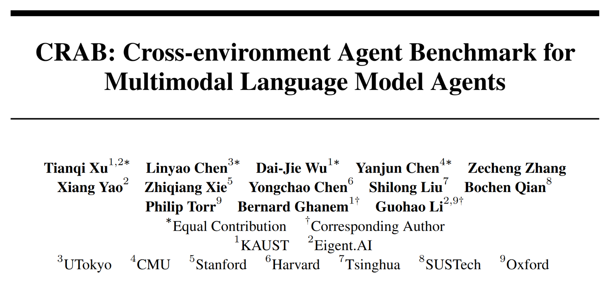
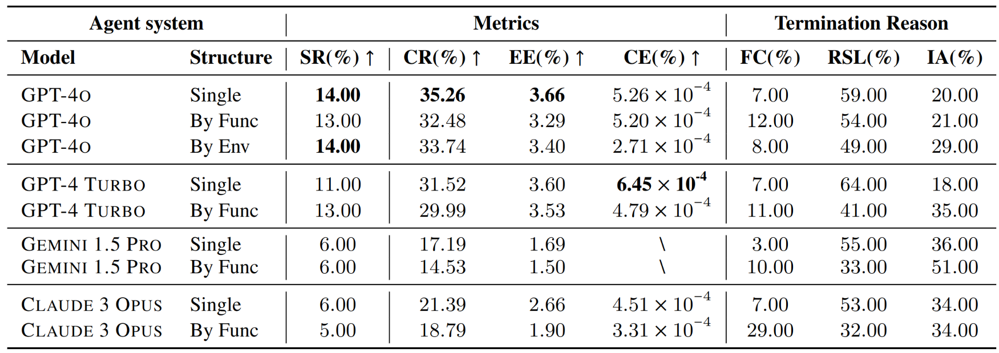
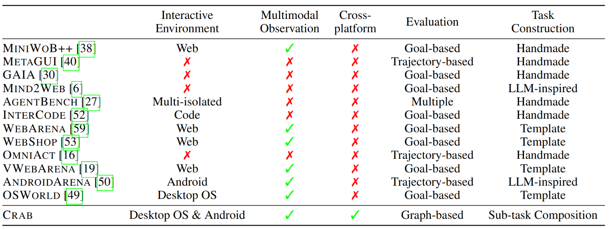
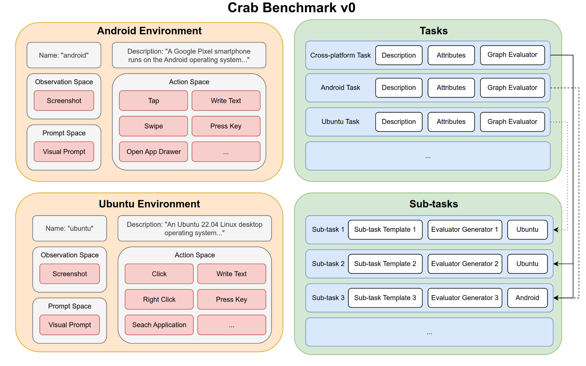
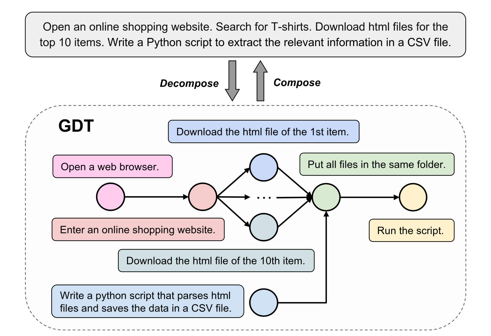
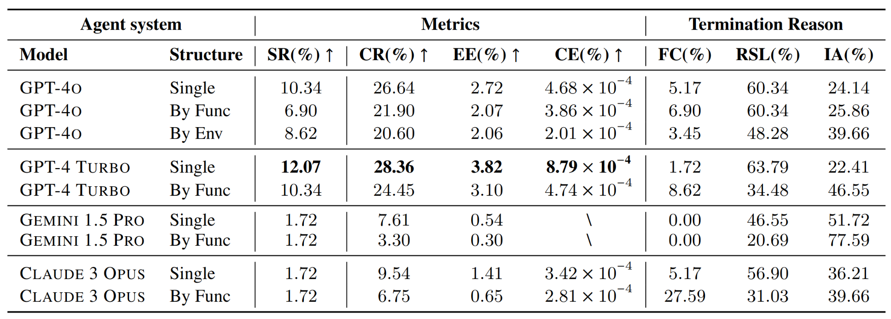
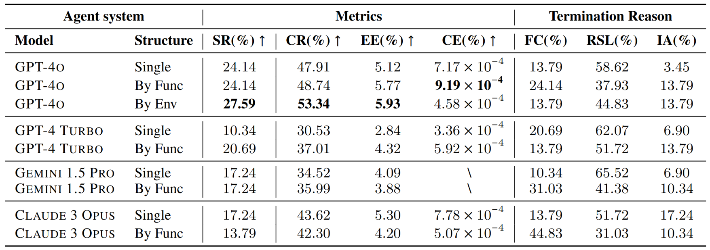
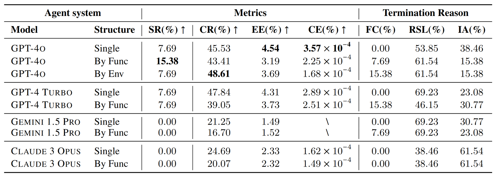

+++
title="全新基准测试CRAB！智能体可以同时操作手机和电脑？！GPT-4o竟然只拿了35.26分。"
date=2024-08-10

[taxonomies]
tags = ["academic", "agent", "benchmark", "llm"]
+++

> 近日，由多智能体开源项目的先驱CAMEL-AI社区主导，来自阿卜杜拉国王科技大学、牛津大学、东京大学、卡内基梅隆大学、斯坦福大学、清华大学等高校和机构的社区研究者开发了一个跨平台的多模态智能体基准测试框架：CRAB，开创性地使用智能体同时操作多个设备。

## 介绍

随着多模态大语言模型（MLLM）的迅猛发展，今年涌现出众多能够操作图形用户界面（GUI）的智能体。各大厂商纷纷推出各自的创新解决方案，竞争非常激烈。GUI智能体通过大模型强大的视觉理解和推理能力，如今已经能够高效灵活地完成预约、购物和智能家居控制等任务。

这不禁令人遐想，未来的智能体是否真的可以坐在电脑前替我办公？

然而，在当下万物互联的时代，绝大部分工作都需要多个设备协同。举个例子，比如用手机拍完照片，然后发到电脑上P图 ，这就需要跨越了两种设备(环境)了。但目前这些GUI智能体都只能在一个设备上进行操作，这个对人类来说轻而易举的任务对目前的智能体却难如登天。

CAMEL-AI社区的研究人员注意到了这一问题，提出了第一个支持跨环境，多设备的智能体Benchmark框架--CRAB，即跨环境智能体基准测试（CRoss-environment Agent Benchmark）。

> 论文地址: [https://arxiv.org/abs/2407.01511](https://arxiv.org/abs/2407.01511)

[CAMEL-AI社区](https://www.camel-ai.org)开发的[CAMEL框架](https://github.com/camel-ai)是最早的基于大语言模型的多智能体开源项目，因此社区成员都是在智能体领域有着丰富的科研和实践经验的研究者和工程师。

作者在CRAB中不仅设计了基于网络的多环境架构，使得智能体能够同时操作多台设备完成任务，还针对现有智能体Benchmark存在的问题提出了图评估器和任务合成两项新技术。CRAB不仅是一个全新的基准测试工具，还提供了一个环境与智能体之间的交互协议和其实现，这有望成为Agent在实用领域的重要基础。

作者相信，CRAB未来将成为评测GUI智能体的标准之一，因此在提升框架易用性上下了不少功夫。整个代码库采用模块化设计，每个环境的配置都被抽象成独立且可复用的组件。用户可以像搭积木一样，轻松快速地构建出多个自定义环境，并在此基础上打造自己的Benchmark。

对于那些希望通过CRAB评测自己智能体性能的用户，作者贴心地提供了一个谷歌云平台上的硬盘镜像。只需一键操作，所有繁琐的虚拟机、深度学习模型、Python包等配置都会自动完成，让用户能够立即投入到重要的实验中去。

目前，CRAB的论文已经发布在[Arxiv](https://arxiv.org/abs/2407.01511)，相关代码和数据开源在CAMEL AI社区的[GitHub](https://github.com/camel-ai/crab)上。

说了这么多，CRAB运行起来是什么样的？来看看下面这个视频：

<video id="dollyzoom" controls muted playsinline loop height="100%">
    <source src="CRAB Demo v15.mp4" type="video/mp4">
</video>

上图展示了作者设计的多智能体系统在CRAB上进行测试的流程。

首先，系统在数据集中取出任务，将任务指令传入主Agent，并将对应的图评估器在CRAB中完成初始化。

工作流是一个循环：主Agent观察、计划和指示子Agent；每个子Agent对应一个环境，图中的两个子Agent分别负责Ubuntu系统的电脑和安卓系统的手机，子Agent在各自的平台中执行操作。

图评估器监控平台中各个环境的状态，在每一次Agent操作后更新当前Agent完成任务的进度，并输出评估指标。

了解了CRAB的工作原理，是时候来看看现有的模型在这个全新的Benchmark上表现如何了。作者针对CRAB推出了同时支持两个环境，总计100个任务的数据集CRAB-Benchmark-v0。并对多个最先进的模型做了测试。

可以看到，效果最好的GPT-4o也只拿了35.26分（CR指完成率）。

跨平台任务比单平台任务要复杂得多，能达到第一名的分数已经证明了GPT-4系列模型在解决实际问题上的出色能力。但我们相信层出不穷的新方法和新模型可以在CRAB上拿到更好的分数，真正成为我们解决现实问题的效率工具。

## 跨平台多模态智能体评估

CRAB提供了一个全面的交互式的Agent评估框架。通过CRAB的基础射射，Agent可以同时在各种设备和平台上进行操作，实现在多个互相隔离的系统中高效完成任务。

作者提出了一种称为图评估器的新型评估方法，与传统的基于最终目标或者行为轨迹的方法不同，图评估器通过将任务分解为多个子目标来检查完成任务的中间状态。

每个子目标都被分配了一个评估函数来验证其完成情况，其中每个子目标都被视为图评估器中的一个节点。

图结构描述了子目标之间的前后关系和并列关系，因此可以提供细粒度的评估指标；同时针对每个子目标有独立的评估函数，又原生适应了多种平台。

上表将CRAB与现有框架进行了比较,包括测试涉及的几项关键能力:

* Interactive Environment 区分是使用交互式平台还是静态数据集;
* Multimodal Observation 表示是否支持多模态的输入(例如屏幕截图);
* Cross-platform表示能否同时支持多个操作系统或平台;
* Evaluation描述了评估指标,分为基于目标(仅检查最终目标是否完成)、基于轨迹(将Agent操作轨迹与事先定义的标准操作序列进行比较) 、多重(因任务而异)或基于图(每个节点作为中间检查点的 DAG);
* Task Construction 展示了测试数据集中任务的构建方法,包括人工制作、LLM启发(比如LLM生成任务草稿,但由人工验证和注释)、模板(由人工编写模板并基于任务模板生成多个任务)或子任务组合(组成多个子任务以构建任务描述和评估器)。

基于CRAB框架 , 作者开发了一个基准测试数据集CRAB Benchmark v0, 支持Android环境和Ubuntu环境。

基准测试总共包含100个真实世界的任务,包括跨平台和单平台跨不同难度级别的任务。任务涉及各种常⻅问题,使用了多种实际应用程序和工具,包括但不限于日历、电子邮件、地图、网络浏览器和终端，也再现了智能手机和电脑之间常见的协同方式。

#### 问题定义

假设Agent在设备（例如台式机）上自主执行任务。设备通常配备输入设备（如鼠标和键盘）和输出设备（如屏幕）用于人机交互。作者将一个具有固定输入方式和输出方式的设备或应用称为一个环境。

形式上，单个环境可以定义为无奖励的部分可观测马尔可夫决策过程（Reward-free POMDP），用元组M := (S, A, T, O)表示。其中，S表示状态空间，A表示动作空间，T: S × A → S是转移函数，O是观测空间。

考虑到现实场景中多个设备的协作性质，可以将多个平台组合成一个集合M = {M1, M2, ..., Mn}，其中n是平台的数量，每个平台可以表示为Mj = (Sj, Aj, Tj, Oj)。

一个需要跨多个平台操作的任务可以被形式化为一个元组(M, I, R)，其中M是平台集合，I是以自然语言描述的任务目标，R是任务的奖励函数。

作者把负责完成任务的算法称为Agent系统。Agent系统中的每个Agent使用固定的后端模型和预定义的系统Prompt，并保留其对话历史记录。Agent系统可以是单个Agent，也可以由多个Agent组成分工合作的多Agent系统。

#### 分解任务图

将复杂任务分解为多个更简单的子任务，是为大语言模型提供提示的有效方法。作者将这一概念引入基准测试领域，将复杂任务分解为具有前后和并列关系的子任务，即上图中的分解任务图（GDT: Graph of Decomposed Tasks）。

GDT使用一种基于图的任务分解方法：用DAG结构表示分解后的子任务。

在GDT中，每个节点都是一个子任务，形式化为一个元组(m, i, r)，其中m指定了执行子任务的环境，i提供了自然语言指令，r表示奖励函数。奖励函数函数评估环境m的状态并输出一个布尔值，以确定子任务是否完成。GDT中的边表示子任务之间的顺序关系。

#### 图评估器

为了评估大语言模型作为Agent的能力，大多数基准测试仅基于Agent操作后平台的最终状态来进行评估。

仅判断最终目标是成功还是失败显然不够公平，这就像在数学考试中，如果不会做大题但写了一些解答步骤，还是应该给分的。

另一种方法是基于轨迹匹配，将Agent的操作与每个任务的预定义标准操作序列（Label）进行比较。

然而，在现实世界的系统中，任务可能有多种有效的执行路径。例如，复制文件可以使用文件管理器，也可以使用命令行。如果指定唯一的正确路径，对用不同方式达成目的的Agent并不公平。

所以本文采用了与平台状态同步的图评估器,通过子任务完成的当前状态来跟踪Agent的进度。

除了传统的成功率（SR），即只有在所有子任务都完成时才将任务标记为成功，作者还引入了三个指标来衡量Agent的性能和效率：

1. **完成率（CR）**：衡量完成子任务节点数的比例，计算方式为已完成节点的数量/总节点数。该指标直观地反映了Agent在给定任务上的进展情况。

2. **执行效率（EE）**：计算方式为CR/A，其中A表示执行的动作次数，反映了Agent的任务执行效率。

3. **成本效率（CE）**：计算方式为CR/T，其中T是Agent使用的总token数，评估了Agent在使用成本方面的效率。

#### 实验

要在Crab Benchmark-v0中运行，后端模型需要支持以下功能：

1. 支持多模态混合输入：系统同时提供屏幕截图和文本指令作为提示。
2. 支持多轮对话：所有任务都需要Agent执行多轮操作，因此必须在上下文中存储历史消息。
3. 通过Function Call或类似功能生成结构化输出：用于在环境中执行操作。

实验选择了四种满足这些标准的多模态模型：GPT-4o、GPT-4 Turbo、Gemini 1.5 Pro和Claude 3 Opus。

为了比较多智能体和单智能体的性能差别，本文设计了三种不同的Agent系统：

1. 单Agent（Single Agent）：用单个Agent来进行从理解任务，观察环境，做出计划，到执行动作的整个流程。
2. 根据功能分工的多Agent（Multi-agent by Functionality）：由一个主Agent和一个子Agent组成。主Agent负责观察环境并向子Agent提供下一步的指示，子Agent负责将指示翻译为具体的操作。
3. 根据环境分工的多Agent（Multi-agent by Environment）：由一个主Agent和多个子Agent组成。每个子Agent负责一个环境。主Agent负责理解任务并规划执行流程，向每个子Agent提供下一步的指示，子Agent通过观察自己负责的环境，将指示翻译为在此环境中的具体的操作。

不同Agent系统和后端模型的组合提供了多个维度的比较。另外本文还比较了不同平台的任务中模型的性能：

Ubuntu但平台任务：

Android单平台任务：

跨平台任务：

本文通过数据作出了一系列分析：

1. **模型间表现差异：**

- GPT-4o在整体上具有最高的成功率和完成率。
- GPT-4 TURBO在成本效率（CE）方面表现优于其他模型。
- Gemini 1.5 Pro和Claude 3 Opus在任务完成方面较为困难，几乎无法完成任务。

2. **效率指标体现不同模型的特点：**

- GPT-4 TURBO在单代理模式下的成本效率表现出色，展示了成本效益的性能。
- GPT-4o在效率和性能之间保持平衡，特别是在单代理模式下。
- Gemini 1.5 Pro显示出较低的效率和不完整的成本效率指标，主要原因是其较低的完成率。

3. **评估的终止原因表明可改进的方向：**

- 所有模型的到达步骤限制（RSL）百分比较高，表明Agent经常用尽步骤数，未能实现任务的最终目标。
- Gemini 1.5 Pro的无效操作（IA）率较高，突显了其无法稳定地生成与环境交互所需的正确格式。
- 多Agent系统中的虚假完成（FC）率高于单Agent，表明在多个代理间的通信过程中存在消息丢失，容易使执行操作的子Agent产生误判。